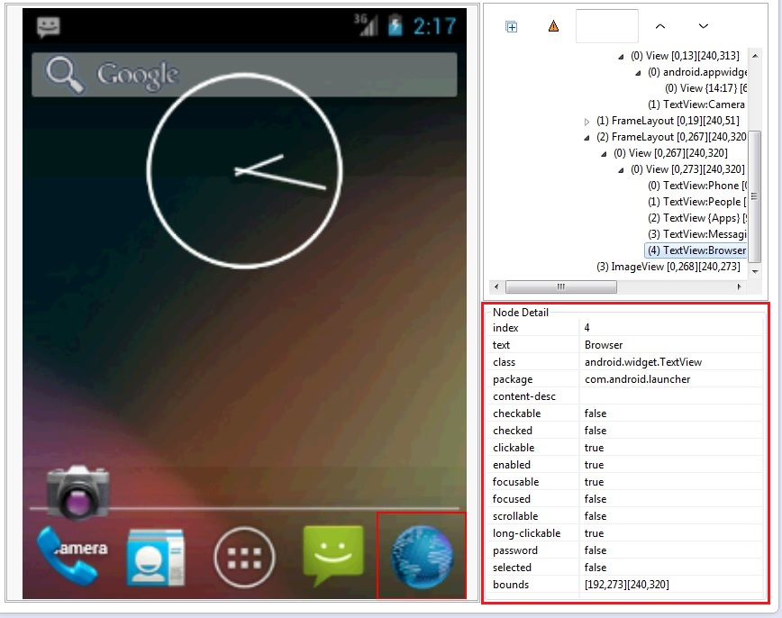

# Creating CSS and Xpath query

Selecting a `UiElement` by **CSS or Xpath** is much faster than selecting it by a Selector. To use CSS or Xpath you should create **a String with the expected syntax**. A single String can contain more than one attribute, so you will only need one Xpath or CSS query to select a `UiElement`.

Example for CSS Query:

```java
final String CSS_QUERY_EXAMPLE = "[bounds=[10,25][34,49]][class=android.widget.ImageView][package=com.example.coolstory]";
```
Example for Xpath Query:

```java
final String XPATH_QUERY_EXAMPLE = "//node[@index=1 and @text='' and @class='android.widget.FrameLayout' and @package='com.example.coolstory']";
```

## Attributes with which you can Select an Element

You can select an Element with the attributes in **NoteDetails** in the Dump XML. Every Element has these attributes and can be selected by one or more of them. Also they contain fields like `Enabled`, `Checked`, `Focused` and others. With them we can check if the interactions are successful or not. For more information you can check [How to dump XML](xml-dump.md).


