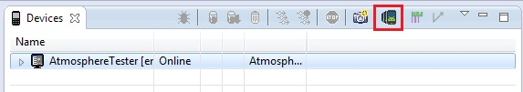

# Get XML Dump

These are the activities that need to be performed in order to dump the XML screen of a Device.

1. Open Eclipse.
2. Go to `Window -> Show View -> Other...`
3. Click on the `Android` folder select `Devices` and click `OK`.
4. A list with devices and emulator connected to the Machine is shown.
5. Locate the device from which you want to dump the XML.
6. Click on the button with an emulator screen icon that says `Dump View Hierarchy for UIAutomator`.

7. Wait for UIAutomator to dump the XML.
